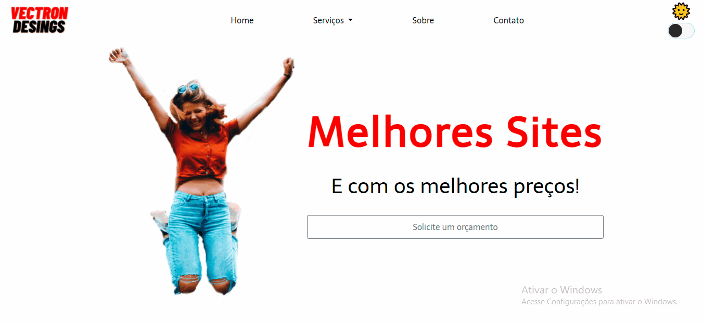

<h1 align="center" >LadingPage<h1>
<h2 align="center">Página de empresa fictícia apenas para estudo</h2>
<h2 color="blue" align="center">
<a href="https://VitorHRD.github.io/ladingpage/">🔗 Site</a>
</h2

<h1 align="center">Modo dark funcionando<h1>
</img>
<h1>🚀 Tecnologias</h1>
 
 <ul>
     <li> HTML5
      <li> CSS3
       <li> JavaScript
        <li>Bootstrap
 </ul>
 
<h1 > 🚀 Status do Projeto </h1>
 
 
 🚧  Em construção... 🚧 

 
 
 
Feito por Vitor Reis
